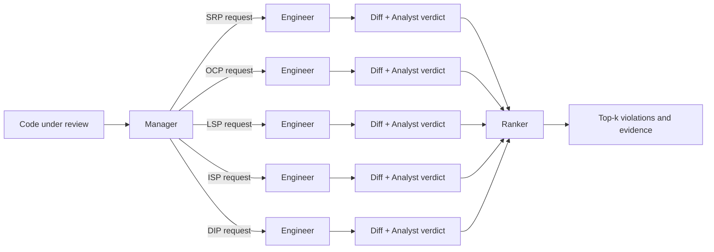

# Extender

**This is a open source codebase for AgenticDev 2026 accept paper:**

**_Extender: A Multi-Agent System for Code Extensibility Review_**

Extender detects violations of the SOLID design principles by testing how code responds to change. Instead of judging only the current source snapshot, it creates principle-specific extension requests, asks AI agents to implement them on isolated copies, and analyzes the resulting diffs for evidence of latent design flaws.

The central idea is simple: many design defects become visible only when a new variant, client, subtype, interface implementation, or dependency must be introduced.

## Highlights

- **Extend-then-detect:** turns abstract design review into concrete extension experiments.
- **Four agent roles:** a Manager, parallel Engineers, an Analyst, and a Ranker.
- **Five SOLID channels:** SRP, OCP, LSP, ISP, and DIP are tested independently.
- **Traceable findings:** every result retains its extension request, revised code, unified diff, verdict, and ranking rationale.
- **Local deployment:** the evaluated setup runs Qwen3.5 9B through Ollama on a consumer GPU.
- **Strong benchmark results:** 87.92% Top-2 accuracy on 240 multilingual examples.

## Why Extender?

Static analyzers rely on predefined structural rules and thresholds. Direct LLM prompts can reason about semantics, but they still inspect only the current form of the code. Both approaches can miss violations whose cost appears only during maintenance.

Extender treats extensibility as an observable experiment:

1. Generate a constrained change request for each SOLID principle.
2. Implement each request on an isolated copy of the input code.
3. Compute a deterministic unified diff against the original.
4. Check the diff against a principle-specific violation pattern.
5. Rank the strongest supported findings and return the Top-*k* results.

## Multi-Agent Workflow



### Agent roles

- **Manager:** creates five code-specific, constrained extension requirements—one for each SOLID principle.
- **Engineer:** implements one requirement on an isolated copy of the input. Each principle has a dedicated channel to keep its context focused.
- **Analyst:** computes a unified diff and determines whether it matches the target principle's violation pattern.
- **Ranker:** discards unsupported candidates, ranks the remaining evidence, and returns the Top-*k* violations. The default is `k = 2`.

## Principle-Specific Extension Probes

| Principle | Extension request | Evidence of a violation |
|---|---|---|
| **SRP** | Change behavior within one architectural layer. | The change spreads into unrelated layers, indicating mixed responsibilities. |
| **OCP** | Add a new type, variant, or case. | Existing `if-else` or `switch` logic must be edited instead of adding behavior through an extension point. |
| **LSP** | Exercise a parent type and its subtypes polymorphically. | A subtype throws, fails, or breaks the behavioral contract expected from the parent. |
| **ISP** | Implement only the needed subset of an existing interface. | The new implementation is forced to carry unused methods or `NotImplementedError` stubs. |
| **DIP** | Replace one concrete dependency with another. | The high-level module must be edited because no useful abstraction separates it from concrete dependencies. |

## Evaluation

The ASE 2026 study evaluates Extender on 240 labeled examples from an existing SOLID benchmark:

- 48 examples for each SOLID principle;
- Java, Kotlin, Python, and C#;
- easy, moderate, and hard difficulty levels;
- one ground-truth violation label per example;
- the same Qwen3.5 9B model for all three local workflows.

Accuracy is Top-2 accuracy: a result is correct when the ground-truth principle appears in the first two ranked predictions.

| System | Top-2 accuracy | MRR@2 | Macro-F1 |
|---|---:|---:|---:|
| One Agent | 70.00% | 0.638 | 0.699 |
| Two Agent | 55.83% | 0.490 | 0.576 |
| **Extender** | **87.92%** | **0.792** | **0.888** |

Extender improves Top-2 accuracy by 17.9 percentage points over the one-agent baseline and by 32.1 points over the two-agent baseline. It leads on SRP, LSP, ISP, and DIP and remains at 80% accuracy on hard examples. OCP is the main exception: visible dispatch branches can often be recognized directly without an extension experiment.

For context, the paper also reports a 95.83% Top-2 result for a one-agent cloud baseline using Qwen3.5 Plus (397B). The local 9B Extender setup reaches more than 92% of that accuracy.

## Repository Layout

```text
Extender/
├── benchmark_config.py           # Models, workflow, dataset, Top-k, and output settings
├── benchmark_runner_langgraph.py # Main LangGraph implementation
├── benchmark_runner.py           # Legacy runner retained for comparison
├── prompts.py                    # One-agent prompts
├── prompts_two_agent.py          # Detector-evaluator prompts
├── prompts_diff_eval.py          # Extender extension and analysis prompts
├── dataset/                      # 240 benchmark examples
├── analysis/                     # Reproducibility and comparison scripts
├── test_cases/                   # Small example inputs and expected outputs
└── test_runner.py                # Lightweight test runner
```

## Quick Start

### 1. Install Python dependencies

Python 3.10 or newer is recommended.

```bash
python -m venv .venv
source .venv/bin/activate
pip install -r requirements.txt
```

### 2. Start a local model

Install [Ollama](https://ollama.com), then start its server and fetch the evaluated model:

```bash
ollama serve
ollama pull qwen3.5:9b
```

### 3. Configure the experiment

Edit `benchmark_config.py`. The release configuration defaults to the paper's Extender workflow:

```python
MODEL_SELECTION = ['qwen3.5:9b']
WORKFLOW_TYPE = 'diff_eval'
VIOLATION_SELECTION = ['SRP', 'OCP', 'LSP', 'ISP', 'DIP']
TOP_N = 2
MAX_EXAMPLES_PER_VIOLATION = None
```

For a quick smoke test, set `MAX_EXAMPLES_PER_VIOLATION = 1`.

### 4. Run Extender

```bash
python benchmark_runner_langgraph.py
```

Results are written under:

```text
result/local/{workflow}/run_{run_id}/{model}/detection_results.json
```

Completed examples can be resumed safely when `SKIP_SUCCESSFUL = True`.

## Cloud Models

Cloud models are supported through OpenRouter. Select a name from `CLOUD_MODELS` in `benchmark_config.py`, then provide the key without committing it:

```bash
export OPENROUTER_API_KEY="your-key"
```

You may also place the value in a local `.env` file. `.env` is ignored by Git.

## Reproducing the Comparisons

Set `WORKFLOW_TYPE` to one of:

| Value | Workflow |
|---|---|
| `single_agent` | Direct SOLID violation detection in one prompt. |
| `two_agent` | Detector-evaluator loop with up to three feedback iterations. |
| `diff_eval` | Extender's five-channel extend-then-detect workflow. |

Use a distinct `RUN_ID` for each run so that outputs remain separate. The analysis scripts expect completed result directories and generate tables and figures for the workflow comparisons.

## Current Scope and Limitations

- The benchmark consists of self-contained snippets with one primary label; repository-scale and multi-file violations remain future work.
- The current implementation executes the five channels sequentially, although the channels are independent and can be parallelized in deployment.
- Extender is best suited to latent defects that become visible under change. A future router could send already-visible violations to a cheaper direct-review path.
- Generated requests are controlled extensibility probes, not predictions of actual future product requirements.
- Extensions are created only on isolated code copies and are never applied to the source project under review.

## Research Direction

Extender is intended as a general code-extensibility review paradigm. A new design rule can be added when its defect manifests as resistance to change: define an extension instruction and a corresponding diff-based violation pattern, then plug that pair into the workflow.

Future work includes repository-level evaluation, concurrent channel execution, a router for directly visible violations, and reviewer-feedback loops that refine the responsible prompt or violation pattern from recorded traces.
